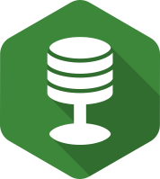

<div align="center">


# Databless
[](https://travis-ci.com/AckeeCZ/databless)
[](https://codeclimate.com/github/AckeeCZ/databless)
[](https://codeclimate.com/github/AckeeCZ/databless)
[](https://snyk.io/test/github/AckeeCZ/databless?targetFile=package.json)
[](https://david-dm.org/AckeeCZ/databless)
[](https://david-dm.org/AckeeCZ/databless?type=dev)



</div>

## Local setup

TODO

## Remote services

### npm

```yaml
deploy:
  provider: npm
  # TODO
  email: ackeedevelopment@gmail.com
  skip_cleanup: true
  # TODO
  api_key:
    secure: G8gmvUC5aRLRicRx...=
  on:
    tags: true
    repo: AckeeCZ/configuru
```

To generate npm api key:
1. Visit [tokens](https://www.npmjs.com/settings/ackeecz/tokens) and create new one with publish permissions
2. `travis login --com`
3. `travis encrypt --com TOKEN`

### Travis
- Check `.travis.yml` (see `node_js` for versions of node, and `script` for the task definition)
- Log in to [Travis](https://travis-ci.com)
- Add the project (wait for permission asking as member of organization)
- Update `script`, `deploy` (add npm, remove GH pages or update API key etc.)

### Codeclimate
- Log in to [CodeClimate](https://codeclimate.com/oss/dashboard)
- Add the project
- Setup travis `CC_TEST_REPORTER_ID` env
- Setup coverage in `.travis.yml` (will only update in `master` branch with default config)


### Snyk
Badge works out of the box, just update links. However, you can register the project:

- Log in to [Snyk](https://app.snyk.io)
- Add project
- Update badge source and link

### David
- No need to integrate, just update links

## License

This project is licensed under [MIT](./LICENSE).
